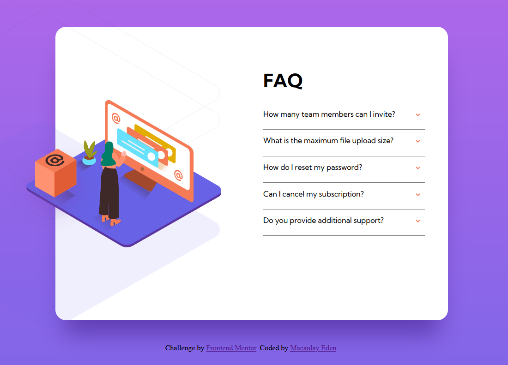

# Frontend Mentor - FAQ accordion card solution

This is a solution to the [FAQ accordion card challenge on Frontend Mentor](https://www.frontendmentor.io/challenges/faq-accordion-card-XlyjD0Oam). Frontend Mentor challenges help you improve your coding skills by building realistic projects. 

## Table of contents

- [Overview](#overview)
  - [The challenge](#the-challenge)
  - [Screenshot](#screenshot)
  - [Links](#links)
- [My process](#my-process)
  - [Built with](#built-with)
  - [What I learned](#what-i-learned)
  - [Continued development](#continued-development)

## Overview

### The challenge

Users should be able to:

- View the optimal layout for the component depending on their device's screen size
- See hover states for all interactive elements on the page
- Hide/Show the answer to a question when the question is clicked

### Screenshot

### Links

- Solution URL: [Add solution URL here](https://your-solution-url.com)
- Live Site URL: [Add live site URL here](https://your-live-site-url.com)

## My process

### Built with

- Semantic HTML5 markup
- CSS custom properties
- Flexbox
- Mobile-first workflow

### What I learned

I applied some recently learned aspects of flexbox, and also greatly the CSS transform ability, using this to place the images on the sides of the container. 

By challenging myself to make this responsive, and not two static pages as originally set, i gained some comfort in scaling images over screen widths. 

### Continued development

I learned the importance of preparing all aspects of a design beforehand, as at the end I came across the issue of needing to clip the background and image of the woman on desktop, but not the image of the box with the container they are all in. If i set a overflow: flip; on the container, all images were clipped. To fix this I would need to add an outer container, and move the CSS to the inner container with all the content and then set the clip on this. Then make the box image a sibling of the inner container and position it then. 

This would not be worth the work for a minor change for this learning, but was a good lesson. I will continue to improve on my flexbox skills also. 
